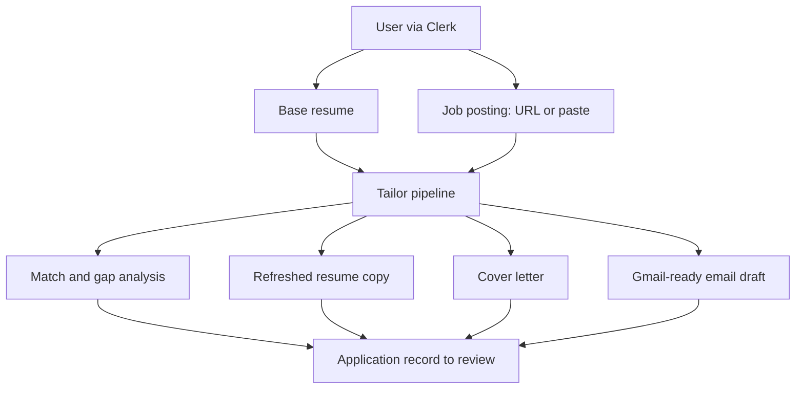

# TalentStreamAI

[](https://www.python.org/)
[](https://fastapi.tiangolo.com)
[](https://github.com/Kludex/mangum)
[](https://docs.astral.sh/uv/)
[](https://nodejs.org/)
[](https://nextjs.org)
[](https://react.dev)
[](https://www.typescriptlang.org/)
[](https://tailwindcss.com)
[](https://clerk.com)
[](https://github.com/langchain-ai/langgraph)
[](https://python.langchain.com)
[](https://openrouter.ai)
[](https://github.com/openai/openai-python)
[](https://langfuse.com)
[](https://www.terraform.io)
[](https://www.docker.com)
[](https://www.postgresql.org)
[](https://aws.amazon.com/sdk-for-python/)
[](.github/workflows/deploy.yml)
[](.github/workflows/destroy.yml)

**AWS** (see `terraform/`)

[](https://aws.amazon.com/api-gateway/) [](https://aws.amazon.com/lambda/) [](https://aws.amazon.com/ecr/) [](https://aws.amazon.com/fargate/) [](https://aws.amazon.com/elasticloadbalancing/application-load-balancer/) [](https://aws.amazon.com/cloudfront/) [](https://aws.amazon.com/rds/aurora/)

[](https://aws.amazon.com/s3/) [](https://aws.amazon.com/secrets-manager/) [](https://aws.amazon.com/cloudwatch/) [](https://aws.amazon.com/dynamodb/) [](https://aws.amazon.com/iam/) [](https://aws.amazon.com/vpc/)

*Optional:* VPC interface endpoints (e.g. ECR, Secrets Manager) for private subnets where present in stack.

*Live* GitHub **Actions status** images (pass/fail) use your repo path, for example:  
`https://github.com/<org>/<repo>/actions/workflows/deploy.yml/badge.svg` — same for `destroy.yml`.

Squad Five capstone for the Andela AI Engineering Bootcamp. The product helps a candidate move from “I found a role” to “I submitted strong materials” without spending an afternoon on manual rewrites: **Clerk**-authenticated users keep a **base resume**, run **tailor** jobs against a job URL or pasted description, and review **applications** with match analysis, a tailored resume, cover letter, and email draft.

The repository ships a full **FastAPI** backend, a **Next.js** app, **LangGraph** orchestration for LLM steps, and **PostgreSQL** (local Docker or **Aurora** in AWS). In **AWS**, `scripts/deploy.sh` builds a **Next.js production image** (`next start`), pushes it to **ECR**, and Terraform runs it on **ECS Fargate** behind an **ALB**; **CloudFront** is the public edge (it routes to the ALB for the UI, and to API Gateway for `/api/*`). An **S3** bucket for the “frontend” name still exists in Terraform (e.g. backups / legacy) but **the live site is not served as a static export from S3**—it is the container on ECS. Locally you use `next dev` (Docker Compose or host); production browser traffic hits CloudFront → ALB → ECS, not S3 object hosting for HTML.

### Product flow (high level)



**Product direction (for context):**

- Ingest a resume plus a job posting URL (or paste).
- Diff the candidate’s story against the role (ATS-oriented gap analysis).
- Generate refreshed resume copy, a cover letter with narrative structure, and a Gmail-ready draft.

---

## Architecture

Documentation is split by audience:

| Doc | What it covers |
| --- | --- |
| [**agentarchitecture.md**](agentarchitecture.md) | End-to-end **system and AI architecture**: product flow, LangGraph `StateGraph` (tailor pipeline), tools, persistence, Next.js + AWS, observability, deployment notes, and optional legacy/MCP paths. |
| [**backend/docs/ARCHITECTURE.md**](backend/docs/ARCHITECTURE.md) | **Backend-only** view: engineering principles, data model, **mounted HTTP API** contract, logging/metrics/Langfuse, runtime config, and AWS Lambda behavior. |

Start with **agentarchitecture.md** for the big picture; use **ARCHITECTURE.md** when working inside `backend/`.

---

### Environment variables (repo root `.env`)

Required for local development (see [`.env.example`](.env.example) for the full list):

| Key | Description |
| --- | --- |
| `DATABASE_URL` | `postgresql://…` — e.g. Docker Compose Postgres or a dev database. |
| `CORS_ORIGINS` | Comma-separated browser origins (e.g. `http://localhost:3000`). |
| `OPENROUTER_API_KEY` / `OPENAI_API_KEY` | At least one for `AGENT_MODE=llm` (OpenRouter preferred when set; see `.env.example`). |
| `LANGFUSE_*` | Optional: Langfuse keys and base URL for LLM tracing in development. |

Both FastAPI (`pydantic-settings`) and Next.js (via `dotenv-cli` in `frontend/package.json` scripts) read the **same** repo-root `.env`. For **AWS / GitHub Actions**, use the [root deployment guide](../README.md) and put API keys in `app_secrets_json` / `APP_SECRETS_JSON` (see that guide for Langfuse in Lambda).

---

## Prerequisites

- **Docker Desktop** (or Docker Engine) and the Compose plugin for the one-command local stack.
- **[uv](https://docs.astral.sh/uv/getting-started/installation/)** for the Python service (lockfile-backed).
- **Python 3.12** (`backend/.python-version`) and **Node.js** matching `frontend/.nvmrc` (e.g. 22.x) for host-only development.
- **Terraform 1.6+** and **AWS CLI v2** when you deploy to AWS.
- An **AWS account** with credentials when running Terraform or deploy scripts.

Secrets stay out of git. Copy `.env.example` to `.env` at the **TalentStreamAI** folder root (same level as `backend/` and `frontend/`).

---

## First-time local setup (without Docker)

You need a **PostgreSQL** instance and `DATABASE_URL` in the repo root `.env`.

```bash
cp .env.example .env   # set DATABASE_URL, CORS_ORIGINS, and LLM keys
cd backend && uv sync && cd ../frontend && npm install
```

Start each service in its own terminal:

```bash
cd backend
uv run uvicorn app.main:app --reload --host 0.0.0.0 --port 8000
```

```bash
cd frontend
npm run dev
```

Open `http://localhost:3000` for the UI and `http://localhost:8000/docs` for OpenAPI. The app uses `/api/v1/health` and `/api/v1/ready` for health checks.

### Common `.env` keys (detail)

| Key | Consumers | Purpose |
| --- | --- | --- |
| `API_HOST` / `API_PORT` | API | Bind when running Uvicorn manually. |
| `CORS_ORIGINS` | API | Browser origins allowed to call the API. |
| `DATABASE_URL` | API | **Required.** PostgreSQL DSN. In AWS, Lambda sets this from Aurora in `lambda_handler`. |
| `NEXT_PUBLIC_API_URL` | UI | Public API base URL. Leave empty for production builds that use same-origin `/api/*` through CloudFront. |
| `DEPLOYMENT_ENVIRONMENT` | API | Optional label (`local`, `dev`, `staging`, `prod`). |
| `OPENROUTER_API_KEY` / `OPENAI_API_KEY` | API | LLM authentication (see `Settings.chat_completions_api_key` in code). |
| `LANGFUSE_PUBLIC_KEY` / `LANGFUSE_SECRET_KEY` | API | Optional Langfuse tracing; see **backend/docs/ARCHITECTURE.md**. |

---

## Run the full stack in Docker

```bash
cp .env.example .env
docker compose up --build
```

- Postgres (if defined in Compose), API on `http://localhost:8000`, UI on `http://localhost:3000` (`next dev` — not a production `next build`).
- The first run can be slow while images build and dependencies install. After **`package-lock.json`** changes, run `docker compose build frontend` (or `docker compose up --build`) again.

Stop with `docker compose down` in this directory.

---

## What’s implemented

### Product API (mounted on the FastAPI app)

The main user journey uses **Clerk JWTs**, **profile** + **base resume**, and **`POST /api/v1/applications/tailor`**. A concise route list lives in [**backend/docs/ARCHITECTURE.md**](backend/docs/ARCHITECTURE.md#api-surface-frontend-contract); it includes profile, dashboard, applications, resumes, job descriptions, generation (SSE), health, readiness, and metrics.

### LangGraph — two pipelines

1. **Primary (product):** [`app/services/langgraph/streaming_agent.py`](backend/app/services/langgraph/streaming_agent.py) — a **`StateGraph`** with sequential nodes: **analyze** → **resume** → **cover_letter** → **gmail** (`AGENT_MODE=llm` uses `LlmClient`; `stub` uses heuristics). This powers **`run_tailor_pipeline`** and streaming generation. Details: [**agentarchitecture.md**](agentarchitecture.md#langgraph--primary-product-graph-streaming_agentpy).

2. **Legacy (file + URL workflow):** [`app/services/langgraph/workflow.py`](backend/app/services/langgraph/workflow.py) — a seven-node graph (fetch job, parse resume, ATS score, gaps, generate resume/cover letter/email) using **LangChain `ChatOpenAI`**. It is used by `run_talentstream_workflow` and similar call sites; the standalone routes in `app/api/v1/endpoints.py` are **not** mounted on the default `api_router` — the **documented product path** is applications/tailor + stored resume.

### Tools

Under `backend/app/tools/`: **job fetcher**, **resume parser**, **ATS scorer**, and shared **models** — used by the legacy workflow, MCP, and helpers; the tailor path uses the job fetcher when a **job URL** is supplied.

---

## Terraform and deployment

Terraform under `terraform/` defines the AWS stack, including: **API Gateway (HTTP) + Lambda** for the API, **Aurora** + **Secrets Manager**, **ECR** + **ECS Fargate** + **ALB** for the Next.js frontend, **CloudFront** in front of the ALB (and API behavior as defined in `terraform/main.tf`), **S3** for uploads and an app-named frontend bucket (not the primary path for serving the UI in the current design), **VPC** pieces, and observability. **`scripts/deploy.sh`** packages the API Lambda, **builds and pushes the frontend Docker image to ECR** (requires Docker), then runs **`terraform apply`** with `frontend_image_tag` so ECS rolls to the new image; it also invalidates **CloudFront** so clients pick up changes. **Destroy** uses `scripts/destroy.sh`. GitHub Actions uses the same flow with OIDC.

- Copy `terraform/terraform.tfvars.example` to `terraform.tfvars` and set `clerk_*`, `app_secrets_json`, and other inputs (including frontend/ECS-related variables as in the example and `variables.tf`).
- Full runbook, backend state, and **GitHub secrets** are in the [**root `README.md`](../README.md)**.

---

## Project structure

```text
TalentStreamAI/
├── backend/                    # FastAPI (uv, pyproject.toml)
│   ├── app/
│   │   ├── main.py             # App factory, CORS, middleware, lifespan
│   │   ├── api/                # v1 routers (applications, profile, generation, …)
│   │   ├── core/               # Settings, DB, metrics, logging
│   │   ├── services/           # tailor_orchestrator, langgraph, llm, …
│   │   └── tools/              # job fetch, resume parse, ATS
│   ├── lambda/                 # Lambda entry (Mangum, secrets, DB URL)
│   ├── docs/
│   │   └── ARCHITECTURE.md     # Backend architecture & API contract
│   ├── Dockerfile
│   └── pyproject.toml
├── frontend/                   # Next.js (App Router; prod = Docker `next start` on ECS, not S3 static site)
├── terraform/                  # AWS resources
├── scripts/                    # deploy.sh, destroy.sh, ensure-terraform-backend.sh (if present)
├── .github/workflows/          # deploy.yml, destroy.yml
├── agentarchitecture.md        # System + AI architecture (start here for diagrams)
├── docker-compose.yml
├── .env.example
└── README.md                   # This file
```

---

## GitHub Actions

- **`deploy.yml`:** push to **`main`** (default environment per workflow) or **`workflow_dispatch`** for **dev** / **staging** / **prod**; runs `scripts/deploy.sh` with OIDC.
- **`destroy.yml`:** manual only, with confirmation; runs `scripts/destroy.sh`.

See the [**root deployment guide**](../README.md) for environments and secrets. For IAM trust policy shaping, use **`.github/aws/github-oidc-trust-policy.json.example`**.

---

## Where feature work should land

- **HTTP API:** new routes under `backend/app/api/v1/`, included from `backend/app/api/router.py`.
- **Product LangGraph & LLM:** `backend/app/services/langgraph/` and `backend/app/services/llm/`.
- **UI:** `frontend/src/app` and `frontend/src/lib`.
- **Infra:** `terraform/` (optionally `terraform/modules/` as the stack grows).

---

## Quality gates (lightweight)

```bash
cd frontend && npm run lint && npm run build
```

```bash
cd backend && uv sync && uv run python -m compileall -q app
```

Add pytest, Ruff, or mypy as the API surface hardens.

---

## Troubleshooting

- **UI: “Backend not responding.”** Check Uvicorn on `8000`, `CORS_ORIGINS`, and `NEXT_PUBLIC_API_URL` if the browser calls the API on another origin.
- **Docker won’t start.** Start Docker Desktop / the daemon, then `docker compose up --build` from this folder.
- **Terraform / CI init fails (state bucket, etc.).** See [first-time remote state](../README.md#first-time-s3-state-backend-and-github) in the root README.

For **deployment, secrets, and AWS**, use the [**root `README.md`](../README.md)**.
