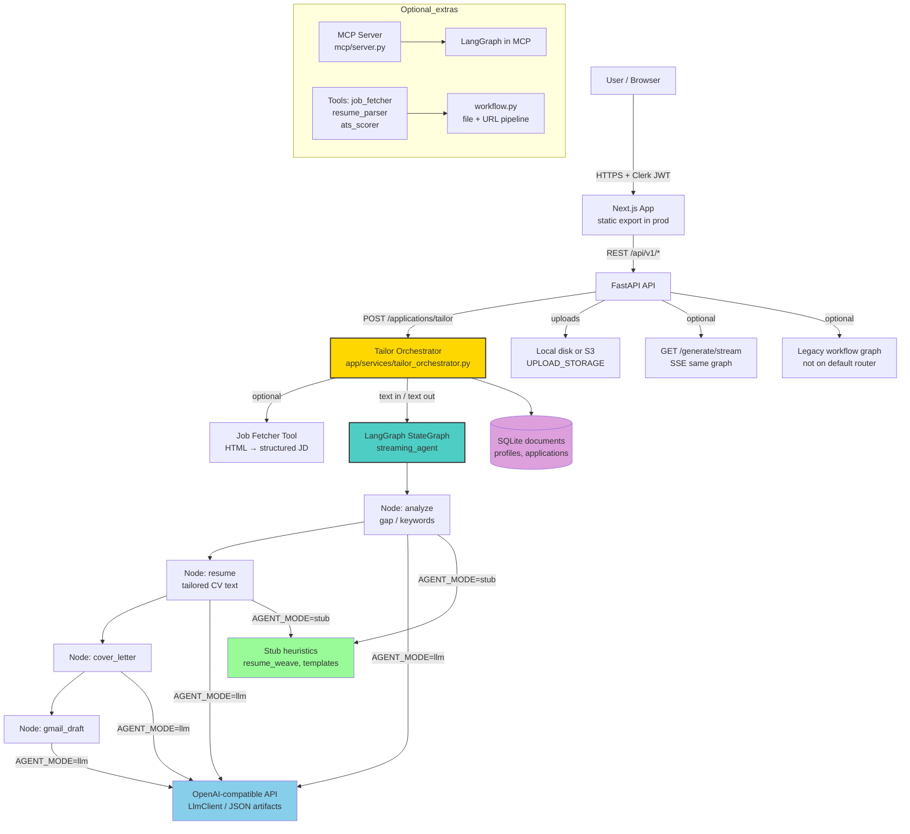
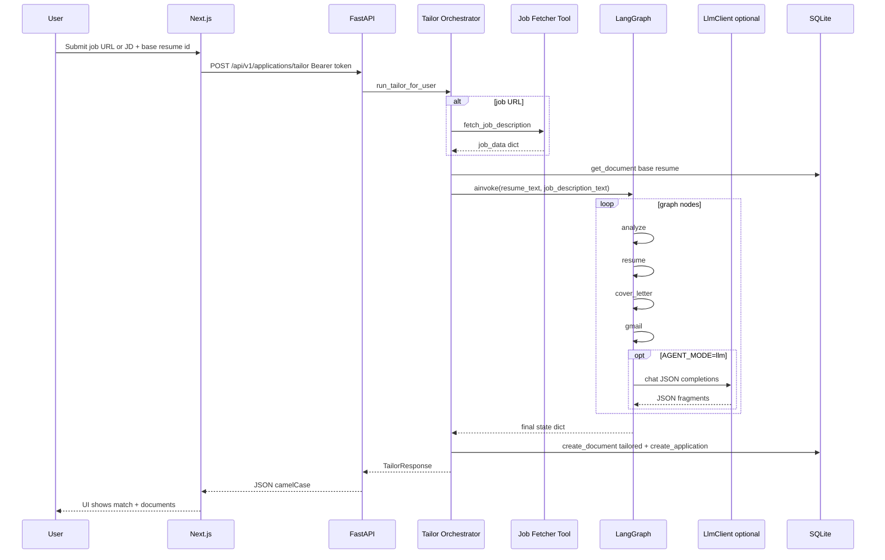
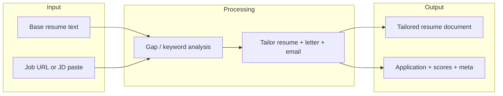

# TalentStreamAI — Agent & System Architecture

This document describes how **AI-assisted job-application generation** is structured in this repository: the **LangGraph** orchestration used for the product API, supporting **tools**, the **Next.js** client, **persistence**, and how **AWS deployment** is intended to evolve (aligned with `terraform/`, `README.md`, and `.github/workflows/deploy-aws.yml`).

---

## High-Level Collaboration Overview

The product’s main path is **not** a fleet of separate micro-agents with message passing. The runtime uses a **single LangGraph** compiled graph (`streaming_agent`) with **sequential nodes** (gap analysis → tailored resume → cover letter → email draft). **LangChain tools** (job fetch, resume parse, ATS score) support **legacy** and **MCP** flows; the **mounted HTTP tailor API** composes **job text** + **stored resume** and runs the graph.

---

## What This Project Delivers (Product Flow)

1. **Identity**: **Clerk**-issued JWTs; FastAPI validates via JWKS when `AUTH_MODE=clerk_jwks` (or `disabled` for local).
2. **Base resume**: User uploads PDF/DOCX; text is extracted, stored in **`documents`**, and **`user_profiles.base_resume_id`** is set.
3. **Tailor run**: User supplies **job URL** and/or **pasted job description**. The orchestrator resolves JD text, loads the base resume, and runs the **LangGraph** pipeline.
4. **Outputs**: **Tailored resume** (new `documents` row), **application** row with **match analysis**, **cover letter**, **draft email** metadata, and **dashboard**-visible stats.
5. **Observability**: **structlog** context, **Prometheus** `/api/v1/metrics`, LLM **token/latency** logging, and optional **Langfuse** traces for **OpenAI-compatible** calls (`LlmClient` + LangChain `ChatOpenAI` in the legacy workflow) when `LANGFUSE_PUBLIC_KEY` and `LANGFUSE_SECRET_KEY` are set.

---

## LangGraph — Primary Product Graph (`streaming_agent.py`)

A **`StateGraph`** is compiled once (with `@lru_cache` on the builder) and executed via **`ainvoke`** (tailor) or **`astream`** (streaming generation).

| Node (order) | Responsibility | `AGENT_MODE=stub` | `AGENT_MODE=llm` |
|---------------|----------------|--------------------|------------------|
| **analyze** | Compare resume vs job text → `gap_analysis` (missing/matched keywords, optional summary) | Heuristic: JD token frequency vs resume (`resume_weave.top_keywords_from_text` + whole-word match) | **LlmClient.chat_json** → `GapAnalysis` schema |
| **resume** | Full **tailored resume** body (plain text) | `resume_weave.weave_keywords_stub` weaves terms into copy; no “scaffold” block | LLM rewrites full resume; must weave `missing_keywords` per prompt |
| **cover_letter** | Narrative cover letter | Short deterministic template | LLM **JSON** → `TextArtifact` |
| **gmail** | Short outreach / application email | Plain template | LLM **JSON** → `TextArtifact` |

**Edges**: `analyze` → `resume` → `cover_letter` → `gmail` → `END`.

**Same graph** serves:

- **`POST` tailor** (via `run_tailor_pipeline` in `tailor_orchestrator.py`)
- **`POST /api/v1/generate/stream`** (Server-Sent Events, `stream_generation`)

---

## Orchestrator: `tailor_orchestrator.py`

**Role**: Application-level coordinator (not a LangGraph node).

- Loads **base resume** from SQLite by id (ownership check).
- If **job URL** present, calls **`fetch_job_description`** (LangChain tool) and flattens to text via **`job_data_to_text`**.
- If only **pasted JD**, uses that string (length / sanity checks).
- Invokes **`run_tailor_pipeline`**; persists **tailored document**, **`application_records`**, match metadata (product-configurable score floor, etc.).
- Does **not** re-parse PDF bytes on this path (resume is already text in DB).

---

## Tools (`backend/app/tools/`)

| Tool | Role | Used in main tailor HTTP path? |
|------|------|-------------------------------|
| **job_fetcher** | HTTP GET + BeautifulSoup → title, company, description fields | **Yes** when `jobUrl` is provided |
| **resume_parser** | PDF/DOCX → structured + raw text | **No** on tailor-by-id; used in **legacy** `workflow.py` and upload parsing elsewhere |
| **ats_scorer** | Keyword / skill overlap heuristics | **No** on streaming graph by default; used in **legacy** workflow and scoring endpoints if mounted |

---

## Legacy LangGraph: `workflow.py` (file + URL, multi-LLM nodes)

A **separate** `StateGraph` (fetch job → **parse file** from base64 → ATS → gaps → generate resume/letter/email) exists for **end-to-end upload flows** and demos. The **`endpoints.py`** that referenced it is **not** included in `app/api/router.py` in the current default API surface. Treat it as **second pipeline** to wire when you need **binary resume + URL** in one call without the SQLite document model.

---

## MCP Server (`mcp/server.py`)

**Role**: Exposes a **LangGraph**-driven experience for MCP-compatible clients (separate from the browser FastAPI app graph wiring). It builds its **own** `StateGraph` and `ainvoke` pattern for tool orchestration. Deploy independently if you use MCP; not required for the **Next.js + FastAPI** product.

---

## Agent / Node Communication (Tailor)

**Image (same flow):** [`agent-node-communication-tailor.png`](./agent-node-communication-tailor.png) in the repository root.

---

## Data Flow (Simplified)

---

## Model & Mode Matrix

| Component | Stub (`AGENT_MODE=stub`) | LLM (`AGENT_MODE=llm`) |
|-----------|-------------------------|------------------------|
| Gap analysis | Frequency / token overlap heuristics | `gpt-*` via `LlmClient` + `GapAnalysis` |
| Resume | `resume_weave` keyword weaving + JD hint | JSON `content` field, full resume |
| Cover letter / email | Short templates | JSON `TextArtifact` |
| External API | None | `LLM_BASE_URL` + `OPENROUTER_API_KEY` and/or `OPENAI_API_KEY` (OpenAI-compatible) |

**Production safety** (`app/main.py`): in deploy-like environments, **`AGENT_MODE=llm`**, **`UPLOAD_STORAGE=s3`**, **`AUTH_MODE=clerk_jwks`** are enforced to avoid running stub/anonymous in prod.

---

## Key Design Principles

1. **Single product graph** for text-in/text-out tailoring; **one** place to add nodes (e.g. human review) later.
2. **Thin HTTP layer** — routers delegate to **`tailor_orchestrator`** and **schemas** (`app/api/schemas/frontend.py`).
3. **Tool reuse** — LangChain `@tool` functions for job fetch and parsing, shared with legacy and MCP.
4. **Stub vs LLM** — same graph shape; swap node implementations on `AGENT_MODE`.
5. **Observability first** — request ids, metrics, LLM token logs; optional OTLP path documented in `backend/docs/ARCHITECTURE.md`.

---

## AWS & Deployment (Align With Repository State)

> **As of this repository:** Terraform under `terraform/` is a **scaffold** — `main.tf` declares **no `resource` blocks**; the checklist describes the **target** shape. **`.github/workflows/deploy-aws.yml`** is **manual** (`workflow_dispatch`) and **does not** push to AWS, ECR, or run `terraform apply` (see the workflow’s echo step).

**Intended** direction (from `terraform/main.tf` comments and `README.md`):

1. **Network** — VPC, subnets, routing (or account landing zone).
2. **Data** — e.g. Aurora Serverless v2 + Secrets; SQLite is dev/single-node only.
3. **Secrets** — AWS Secrets Manager for LLM keys, Clerk config, etc.
4. **Compute** — **ECS Fargate** and/or **Lambda** behind **API Gateway**; container images in **ECR** (FastAPI + LangGraph worker).
5. **Edge** — **CloudFront** + **S3** for the **static Next.js** export; API either same host via custom domain routing or public API URL in `NEXT_PUBLIC_API_URL`.
6. **CI/CD** — **GitHub Actions** with **OIDC** to AWS (see `.github/aws/github-oidc-trust-policy.json.example`); replace the deploy placeholder with: build → push image → `terraform apply` (or split plan/apply), invalidate CloudFront, etc.

**Local / staging parity**: `docker-compose.yml` runs **backend :8000** and **frontend :3000** with **AUTH_MODE=disabled** optional; production requires stricter settings per `app/main.py` startup checks.

**Helper scripts** (from `README.md`): `scripts/deploy-aws.sh` (Terraform **plan**), `scripts/destroy-aws.sh`, optional `TALENTSTREAM_USE_LOCAL_TF_STATE=1` for local state.

---

## Future Extensions (Examples)

- **RAG** over company or role knowledge (embeddings in OpenSearch / pgvector) before the **resume** node.
- **Human-in-the-loop** node before persisting `application_records`.
- **A/B** model routing or structured output validation per node.
- **Wiring** `workflow.py` to a **public** route if you need **one-shot** file+URL without prior upload.
- **Real** `deploy-aws.yml` jobs: OIDC role, ECR push, Terraform apply, S3 sync for `out/`, **CloudFront** invalidation.

---

## Related Docs

- `README.md` — local setup, Docker, Terraform scripts, project tree.
- `backend/docs/ARCHITECTURE.md` — API, persistence, env vars, logging/metrics.
- `.env.example` — all tunables (auth, LLM, S3, observability, match score floors).

This file is the **product-level agent** story; for HTTP route tables, prefer `backend/docs/ARCHITECTURE.md` and OpenAPI at `/docs` when the API is running.
